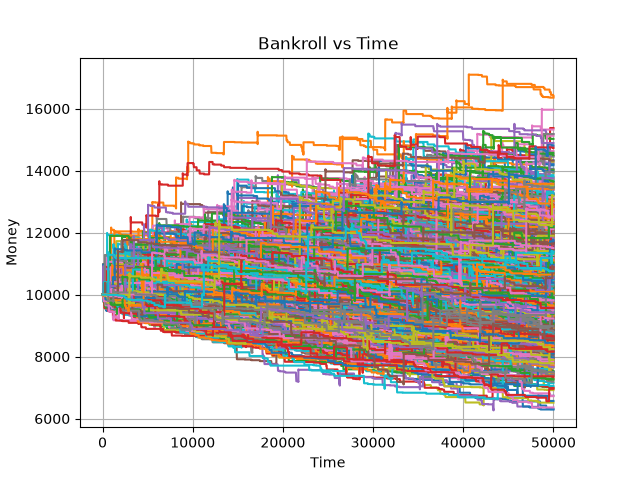

# EZ Baccarat Dragon Seven Sidebet Advantage Play

A friend and I, on the train back from Montreal, were wondering whether the Dragon Seven sidebet
on EZ Baccarat was beatable.

I wrote a simple Monte Carlo sim in C++ to test it, and we found that removing 8s, 9s, 10s, and aces helped the bettor's odds.
I then (with Claude's help - I'm not very good at OCaml yet) wrote a program to calculate the Effect of Removal
on the EV of the Dragon Seven sidebet, confirming our previous hypothesis.

I gave all the EoR numbers to Claude to come up with an effective and human-usable counting scheme. It came up with
0 for all cards valued 0-3, -1 for all cards valued 4-7, and +2 for 8 and 9.

I then wrote a Python simulation to test the profitibility of the strategy given that we found a real statistical edge
in the sidebet. It uses the counting strategy Claude devised and bet sizing a little over half-Kelly for our $10,000 bankroll.[^1]

The simulation revealed that individual return series were very heavily influenced by noise
(which is to be expected given the 40:1 payoff of the sidebet). In the sample below, after 1,000 trials each consistant
of 50,000 games, 550 out of the 1000 made profit and the average profit was $357.73. These results dissapointingly show the
infeasability of this strategy for long-term wealth growth. While it is true you would be gambling with an edge, your returns
would be almost entirely dominated by variance and even still, given the $357.73 number and assuming 100 hands per hour, you would
be making $0.72/hour of play.

[^1]: The half-Kelly sizing is based on the initial bankroll of $10,000, disregarding any swing that may arise.
I figure this is acceptable given the mechanics of a casino bet - you may not bet less than $5 on this sidebet and you must
bet in discrete quantities. It would be more optimal to alter the count at which you start betting dependant on your current bankroll,
but given the poor performance of the overall strategy, I never bothered to implement this.
